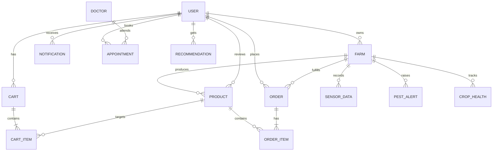

# StellarSoil – Database Schema Design (MongoDB + Mongoose)

This document describes the logical data model used by StellarSoil. It aligns with the current Mongoose models in `server/models/*.js` and supports multi‑farm ordering, COD verification, notifications, geospatial search, and AI/farm management features.

- Storage: MongoDB
- ODM: Mongoose
- Identity/roles: Single `users` collection with role enum (`user`, `farmer`, `admin`)
- Notable design choices:
  - Per‑farm order splitting; each order belongs to exactly one farm
  - Denormalized `order.farmer` for fast farmer dashboards
  - Per user–per farm single cart (unique compound index)
  - Text search on products; 2dsphere indexes for geo queries
  - TTL on recommendations and notifications

## Entity Relationship Overview



Notes
- Admin is a `USER.role === 'admin'`, not a separate collection.
- `ORDER_ITEM` and `CART_ITEM` are embedded subdocuments in their parents.
- Geospatial fields use GeoJSON Point with 2dsphere indexes where noted.

---

## Collections and Schemas

Below, “Path” references the source model in the repository. Required fields are marked (required).

### users
- Path: `server/models/User.js`
- Fields
  - name (string, required)
  - email (string, required, unique, lowercase, validated)
  - password (string, required, bcrypt‑hashed)
  - role (string enum: user|farmer|admin; default user)
  - farmId (ObjectId→Farm, nullable)
  - kisanId: { documentPath (string), verified (bool, default false) }
  - isActive (bool, default true)
  - isVerified (bool; farmers require admin approval)
  - address (string)
  - phone (string)
  - location (GeoJSON Point; default [0,0])
  - favorites ([ObjectId→Product])
  - preferredLanguage (enum: en|ta|hi; default en)
  - defaultRegion: { state, district, market, variety }
  - timestamps
- Indexes
  - email (asc)
  - role (asc)
  - location.coordinates (2dsphere)

### farms
- Path: `server/models/Farm.js`
- Fields
  - name (string, required)
  - ownerId (ObjectId→User, required)
  - description (string)
  - location (GeoJSON Point) – 2dsphere indexed
  - address (string, required)
  - contactPhone (string, required)
  - email (string)
  - farmType (enum: organic|conventional|hydroponic|mixed; default organic)
  - farmSize: { value (number), unit (enum: hectare|acre|bigha|katha) }
  - businessHours: { monday..sunday: { open, close } }
  - specialCrops (string)
  - certifications ([string])
  - certificates ([ { file, uploadDate, score, grade, details{ certificateType, issuer, validUntil, farmerName, farmSize, location, crops, isOrganic } } ])
  - certificationScore (number, default 0)
  - images ([string])
  - website, socialMedia{ facebook, instagram, twitter }
  - rating (number), reviews [ { user, rating, comment, date } ]
  - isVerified (bool, default false)
  - timestamps
- Indexes
  - location (2dsphere)
  - certificationScore (desc)

### products
- Path: `server/models/Product.js`
- Fields
  - name (string, required)
  - farm (ObjectId→Farm, required)
  - category (string, required)
  - description (string)
  - price (number, required)
  - unit (string, required) – supports kg, piece, bundle, liter(s), etc.
  - stock (number, required)
  - quantity (number, required)
  - images ([string])
  - isOrganic (bool, default false)
  - isActive (bool, default true)
  - seasonality { start (date), end (date) }
  - tags ([string])
  - rating (number), reviews [ { user, rating, comment, date } ]
  - timestamps
- Indexes
  - Text: name + description + tags

### carts
- Path: `server/models/Cart.js`
- Fields
  - user (ObjectId→User, required)
  - items [ { product (ObjectId→Product, required), quantity (number, min 1, required), price (number) } ]
  - farm (ObjectId→Farm, optional)
  - timestamps
- Indexes
  - Unique compound: { user: 1, farm: 1 } – one cart per user per farm

### orders
- Path: `server/models/Order.js`
- Invariant: one order belongs to exactly one farm; buyers checking out from multiple farms produce multiple orders.
- Fields
  - buyer (ObjectId→User, required)
  - farm (ObjectId→Farm, required)
  - farmer (ObjectId→User) – denormalized owner for fast queries
  - items [ { product (ObjectId→Product, required), quantity (number, required), price (number, required), unit (string, required) } ]
  - totalAmount (number, required)
  - discount (number, default 0), discountCode (string)
  - deliveryAddress { street, city, state, zipCode, phoneNumber, coordinates: GeoJSON Point }
  - deliveryType (enum: pickup|delivery, required)
  - deliverySlot { date, timeSlot }
  - paymentStatus (enum: pending|paid|failed; default pending)
  - paymentMethod (enum: upi|card|cod, required)
  - orderStatus (enum: placed|confirmed|processing|ready|out_for_delivery|delivered|cancelled; default placed)
  - verificationCode { code, generatedAt, verifiedAt, verified }
  - deliveryVerification { required, verified, verifiedBy, verifiedAt }
  - statusHistory [ { status, timestamp } ]
  - timestamps
- Indexes
  - { buyer: 1, createdAt: -1 }
  - { farm: 1, createdAt: -1 }
  - { farmer: 1, createdAt: -1 }
  - { "deliverySlot.date": 1 }

### notifications
- Path: `server/models/Notification.js`
- Fields
  - userId (ObjectId→User, required)
  - type (enum: order|payment|weather|pest_alert|price_update|system|appointment)
  - title (string, required), message (string, required)
  - data (Mixed, default {})
  - isRead (bool, default false)
  - priority (enum: low|medium|high|critical; default medium)
  - actionUrl (string)
  - expiresAt (date, default +30 days)
  - timestamps
- Indexes
  - { userId: 1, isRead: 1, createdAt: -1 }
  - TTL on `expiresAt`

### doctors
- Path: `server/models/Doctor.js`
- Fields: name, specialization, experience, contact, availability { days[], time }, timestamps

### appointments
- Path: `server/models/Appointment.js`
- Fields: user (→User, required), doctor (→Doctor, required), date (string), time (string), status enum (Pending/Confirmed/Cancelled/Completed), timestamps

### farm management (AI/IoT)
- Path: `server/models/FarmManagement.js`
- SensorData: farmId (→User), temperature, humidity, soilMoisture, soilPH, rainfall, timestamp
  - Index: { farmId: 1, timestamp: -1 }
- PestAlert: farmId (→User), pestType, severity enum, location, detectedAt, status enum, images[], notes
  - Index: { farmId: 1, status: 1 }
- CropHealth: farmId (→User), cropType, plantingDate, expectedHarvestDate, growthStage enum, healthStatus enum, diseaseDetections[], images[], notes
  - Index: { farmId: 1 }
- Recommendation: userId (→User), type enum, items[{ itemId, score, reason }], location (GeoJSON Point), createdAt (expires 24h)
  - Indexes: location (2dsphere); { userId: 1, type: 1 }

---

## Reference Workflows supported by the schema

- Multi‑Farm Checkout
  - `carts` are stored per user+farm; during checkout, items are grouped by `farm` and N `orders` are created.
  - Each `order` decrements product `stock`, records item `price` and `unit` at order time, and sets `farmer` from farm owner.

- COD Delivery Verification
  - `orders.verificationCode` stores code lifecycle; `deliveryVerification` captures final validation.

- Search and Discovery
  - Full‑text search on `products` using text index.
  - Nearby farms/products using 2dsphere indexes on `farms.location` and `users.location`.

- Notifications and IoT
  - Time‑bound `notifications` with TTL cleanup; recommendation documents also expire after 24h.

---

## Example Documents (abridged)

User
```json
{
  "_id": "...",
  "name": "Asha",
  "email": "asha@example.com",
  "role": "user",
  "location": { "type": "Point", "coordinates": [80.27, 13.08] },
  "favorites": ["<productId>"]
}
```

Product
```json
{
  "_id": "...",
  "name": "Organic Tomatoes",
  "farm": "<farmId>",
  "price": 40,
  "unit": "kg",
  "stock": 120,
  "tags": ["organic", "tomato"]
}
```

Order (per farm)
```json
{
  "_id": "...",
  "buyer": "<userId>",
  "farm": "<farmId>",
  "farmer": "<ownerUserId>",
  "items": [ { "product": "<productId>", "quantity": 2, "price": 40, "unit": "kg" } ],
  "totalAmount": 80,
  "paymentMethod": "cod",
  "orderStatus": "placed",
  "deliveryAddress": { "street": "..", "coordinates": {"type": "Point", "coordinates": [80.27,13.08]} }
}
```

---

## Mapping back to the code

- Users: `server/models/User.js`
- Farms: `server/models/Farm.js`
- Products: `server/models/Product.js`
- Carts: `server/models/Cart.js`
- Orders: `server/models/Order.js`
- Notifications: `server/models/Notification.js`
- Doctors/Appointments: `server/models/Doctor.js`, `server/models/Appointment.js`
- Farm Management: `server/models/FarmManagement.js`

If you want PNG/SVG exports of the ER diagram, I can generate and add assets alongside this document.
